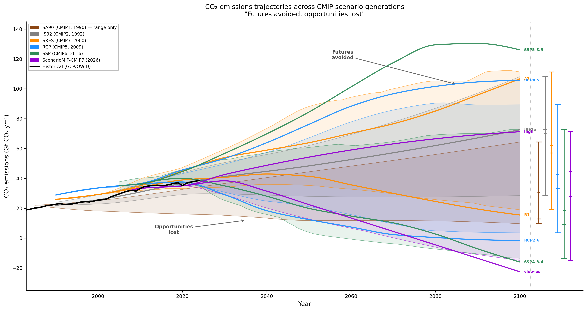

# Futures Avoided, Opportunities Lost
## The History of Climate Change Emissions Scenarios, CMIP, and the IPCC Assessment Reports

**Author:** Paul J. Durack  
**Repository:** `git/scenarios`  
**Date:** 2026-05-24

---

## Overview

For more than three decades, the international climate science community has developed successive generations of emissions scenarios to drive climate model simulations and inform the Intergovernmental Panel on Climate Change (IPCC) Assessment Reports. Each generation has refined our understanding of the plausible range of future emissions — and each generation has told the same story: the extreme high-end futures we once feared have been rendered implausible by policy and energy transitions; the ambitious low-end futures we once hoped for have slipped further out of reach.

This is the story of **futures avoided, and opportunities lost**.

The figure accompanying this document captures that story quantitatively: the CO₂ emissions envelope has shifted downward with each scenario generation, from the alarming trajectories of the 1990s to the more constrained — but still challenging — pathways of the 2020s. The retrospective assessments of Girod *et al.* ([2009](#girod2009)) and Pederson *et al.* ([2021](#pederson2021)) provide quantitative evaluations of how well each scenario generation tracked observed emissions. The comprehensive review of the CMIP programme by Durack *et al.* ([2025](#durack2025)) provides authoritative dates and details for each MIP phase, and Meehl ([2023](#meehl2023)) documents the symbiotic relationship between CMIP and the IPCC assessment cycle.

Embedded within this downward shift is a pivotal, qualitative milestone: for the first nineteen years of IPCC scenario development — across SA90, IS92, and SRES — every scenario, even the most ambitious, projected **positive** CO₂ emissions at 2100. The world's lowest plausible futures still emitted carbon. That changed irrevocably with RCP2.6 in 2009, the first scenario used to drive CMIP simulations that required **net removal** of CO₂ from the atmosphere by century's end (−1.5 GtCO₂ yr⁻¹ at 2100). By the SSP generation, multiple scenarios require net-negative emissions, with the deepest reaching −16 GtCO₂ yr⁻¹. This crossing of zero is the quantitative signature of opportunities lost: what was once achievable by slowing emissions now requires actively undoing them.

---

## Part 1 — The First Assessment Report and SA90 Scenarios (1990)

### Precursors: FANGIO and PCMDI (1984–1989)

Before the first formal model intercomparison project, the US Department of Energy established the **Program for Climate Model Diagnosis and Intercomparison (PCMDI)** at Lawrence Livermore National Laboratory in 1989, to develop methods and tools for the diagnosis, validation, and intercomparison of global climate models (Durack *et al.* [2025](#durack2025)).

The immediate scientific precursor to AMIP was the **Feedback ANalysis of GCMs and In Observations (FANGIO)** project, initiated in 1984. FANGIO was explicitly designed to examine cloud feedback mechanisms by prescribing a defined sea surface temperature perturbation; it attracted 19 atmospheric model configurations and concluded that cloud feedbacks were the primary cause of differences in modelled climate sensitivity (Cess and Potter, 1988; Cess *et al.* 1989, 1990). FANGIO established the key principle of standardised boundary conditions enabling direct model comparison — the intellectual foundation of all subsequent MIPs.

### The IPCC and Its First Assessment

The IPCC was established in December 1988 by the World Meteorological Organization (WMO) and the United Nations Environment Programme (UNEP). Its first major product, the **First Assessment Report (FAR, [Houghton *et al.* 1990](#houghton1990))**, provided the scientific foundation for the United Nations Framework Convention on Climate Change (UNFCCC), which was adopted at the 1992 Rio Earth Summit.

The FAR's Working Group I (physical science) relied on a set of emissions scenarios developed specifically for the assessment, known informally as the **SA90 scenarios** — "Scenario A through E from 1990" — documented in Chapter 2 of the Working Group III (Response Strategies) report by Tirpak and Vellinga ([1990](#tirpak1990)).

### The SA90 Scenarios

Five scenarios were constructed spanning a range of policy responses:

| Scenario | Description | 2100 CO₂ (approx., GtCO₂ yr⁻¹) |
|---|---|---|
| 2030 High Emissions | Business-as-usual; high fossil growth | ~82 |
| 2060 Low Emissions | Moderate controls, late action | ~38 |
| Control Policies | Emissions controls from 2000 | ~13 |
| Accelerated Policies | Aggressive near-term mitigation | ~10 |
| Alternative Accelerated Policies | Alternative low pathway | ~10 |

Data were provided at sparse time points (1985, 2000, 2025, 2050, 2075, 2100), reflecting the limited integrated assessment modelling infrastructure of the time. Emissions were expressed in **Petagrams of Carbon per year (PgC yr⁻¹)** — not yet the CO₂ convention that would become standard — requiring conversion by the molecular weight factor 44/12 (≈ 3.667) to obtain GtCO₂ yr⁻¹.

The SA90 scenarios bracketed an enormous range: the high scenario projected nearly an order-of-magnitude increase in emissions by 2100; the low scenarios showed that aggressive policy could stabilise or reduce emissions. These were not generated by the sophisticated integrated assessment models (IAMs) that would characterise later generations — they were expert-judgement constructions based on demographic and economic trends.

### The Climate Modelling Context: AMIP (1989) and CMIP1 (1995–1996)

The SA90 scenarios were used in the FAR primarily with simple climate models (energy-balance models and upwelling-diffusion models), not with coupled general circulation models (GCMs). However, early AMIP1 results were assessed in the FAR model evaluation chapter (Gates *et al.* [1990](#gates1990far)), establishing a direct — if nascent — link between the emerging MIP programme and the IPCC assessment cycle.

**AMIP1** (planning and operations both beginning in 1989; Durack *et al.* [2025](#durack2025), Table 1) was organised under the WCRP Working Group on Numerical Experimentation (WGNE), directed by Gates ([1992](#gates1992)). AMIP prescribed observed sea surface temperatures and sea ice for the 1979–1988 period to atmospheric GCMs, allowing systematic comparison of atmospheric model performance. AMIP did not use the SA90 emissions scenarios — it was an atmosphere-only evaluation framework using observed boundary conditions — but it established the infrastructure and culture of community model intercomparison that would evolve into CMIP.

Meanwhile, the WCRP Steering Group on Global Coupled Models (SGGCM) was established in **November 1990** to coordinate the growing interest in coupled atmosphere–ocean simulations (Meehl [2023](#meehl2023)). This group, and its successors, provided the organisational backbone for CMIP.

**CMIP1** was designed after a workshop at the Scripps Institution of Oceanography in **October 1994** (Meehl [1995](#meehl1995)), with planning beginning in 1995 and operations (data collection) from 1996 (Durack *et al.* [2025](#durack2025), Table 1). CMIP1 collected output from coupled GCM **present-day control runs** (pdcntrl) — simulations with constant CO₂ and other forcings, loosely following the AMIP1 protocol. Like AMIP, CMIP1 did not use the SA90 emissions scenarios for future projections; it was a model evaluation exercise. Like AMIP1 results in the FAR, the resulting CMIP1 papers were assessed in the IPCC SAR and TAR (McAvaney *et al.* [2001](#ipcc2001)).

---

## Part 2 — IS92 Scenarios and the Second Assessment Report (1992–1995)

### Updating the Scenarios

The SA90 scenarios were recognised as too sparse and too uncertain to support the more sophisticated model simulations and policy analyses being demanded in the wake of the UNFCCC. In 1992, a new set of six scenarios was published in the IPCC Supplementary Report: the **IS92 scenarios** (IS92a through IS92f), developed by Leggett, Pepper, and Swart ([1992](#leggett1992)) and documented with extensive tabular data in Pepper *et al.* ([1992](#pepper1992)).

The IS92 scenarios represented several advances over SA90:

- **Six scenarios** (IS92a–f) spanning a wide range of socioeconomic assumptions about population, economic growth, energy mix, and land use from 1990 to 2100
- **Full GHG suite**: the first set to estimate future concentrations for CO₂, CH₄, N₂O, and halocarbons in a consistent framework
- **IS92a** emerged as the de facto "central" or "reference" scenario — comparable to a business-as-usual trajectory — and became the most widely cited
- An updated IS92a (derived from June 1990 IPCC estimates) was also circulated, reflecting revised GtC estimates

| Scenario | 2100 CO₂ (approx., GtCO₂ yr⁻¹) | Character |
|---|---|---|
| IS92e | ~128 | Highest (very high growth, coal-intensive) |
| IS92f | ~95 | High |
| IS92a | ~73 | Central/BAU |
| IS92b | ~68 | Moderate-high |
| IS92d | ~36 | Moderate-low |
| IS92c | ~17 | Lowest (low population, low growth) |

The **Second Assessment Report (SAR, [Houghton *et al.* 1995](#houghton1995))** used IS92 scenarios. The AMIP2 community analysis was assessed in the SAR model evaluation chapter (Gates *et al.* [1996](#gates1996)). An IPCC evaluation of the IS92 scenarios was also published in 1994 — *Climate Change 1994: Radiative Forcing of Climate Change and an Evaluation of the IPCC IS92 Emission Scenarios* ([IPCC 1994](#ipcc1994)).

### AMIP2 and CMIP2 (1993–1999)

**AMIP2** (planning from 1993, operations from 1996; Durack *et al.* [2025](#durack2025), Table 1) expanded the AMIP protocol with improved boundary conditions, updated greenhouse gases, ozone, aerosols, and more complex land components, covering the extended 1979–2001 period.

**CMIP2** was planned by the CMIP Panel as part of CLIVAR NEG-2 and **announced in January 1997** (Meehl *et al.* [1997](#meehl1997)), with operations beginning in 1999 (Durack *et al.* [2025](#durack2025), Table 1). CMIP2 expanded the science remit from CMIP1 to include both present-day control runs and transient climate change experiments with **CO₂ increasing at 1% per year** (the 1pctCO2 experiment). This idealised forcing trajectory was chosen for its mathematical tractability and its ability to isolate model climate sensitivity — the rate implied by 1%/yr CO₂ increase is roughly twice the actual anthropogenic forcing trend of the era, making it clearly idealised rather than a realistic projection. Nevertheless, IS92a's emissions trajectory was broadly consistent with this idealised forcing level, such that IS92a served as an implicit background narrative for contextualising CMIP2 results.

An augmented phase **CMIP2+** was announced in May 2000, with a subset of CMIP1/2 contributing groups providing considerably more variable and time coverage, enabling broader scientific investigations (Durack *et al.* [2025](#durack2025)).

This disconnect — between the SA90/IS92 scenarios used to communicate policy-relevant futures in IPCC reports, and the idealised forcings used in the CMIP model comparison exercises — characterised the early phases of CMIP and would not be fully resolved until CMIP5.

---

## Part 3 — SRES and the Third and Fourth Assessment Reports (2000–2007)

### The Special Report on Emissions Scenarios

Recognising the limitations of IS92 — particularly the absence of explicit socioeconomic storylines and the growing gap between the scenarios and real-world trends — the IPCC decided at its September 1996 plenary session in Mexico City to commission a new set of scenarios. The **Special Report on Emissions Scenarios (SRES)**, coordinated by Nebojša Nakicenović (IIASA) and Robert Swart, was published in 2000 (Nakicenovic and Swart [2000](#nakicenovic2000); full text available at [grida.no/climate/ipcc/emission](https://www.grida.no/climate/ipcc/emission/index.htm)).

### The Storyline Framework

The SRES framework introduced a fundamental innovation: **narrative storylines** that embedded quantitative emission trajectories in coherent socioeconomic narratives. Four storyline families were defined (Nakicenovic and Swart [2000](#nakicenovic2000)):

| Family | Narrative | 2100 CO₂ range (GtCO₂ yr⁻¹) | CMIP3 marker scenario (2100 CO₂) |
|---|---|---|---|
| **A1** | Rapid economic growth, convergence between regions, population peaking mid-century. Three sub-groups: A1FI (fossil-intensive), A1B (balanced), A1T (technology) | ~16 to ~135 | A1B-AIM: ~50 |
| **A2** | Fragmented world, regionally-oriented, high and rising population, slower technological change | ~72 to ~126 | A2-ASF: ~107 |
| **B1** | Integrated world economy with rapid shift to services and information, sustainability focus | ~10 to ~38 | B1-IMAGE: ~16 |
| **B2** | Local solutions to sustainability, intermediate population and economic growth | ~39 to ~80 | — (no CMIP3 marker) |

Across these four families, **40 scenarios** were generated by six modelling groups, spanning a wide range of future emissions. Crucially, the SRES scenarios were **"non-intervention" baselines** — they assumed no climate policy beyond that already in place, reflecting the political consensus of the late 1990s that climate policy impacts should be assessed separately.

### Connection to TAR, CMIP3, and AR4

The **Third Assessment Report (TAR, [IPCC 2001](#ipcc2001))** was published in 2001, just one year after SRES. While the timing was tight, the TAR incorporated SRES scenarios, having access to pre-publication drafts and the 1999 SRES draft version. However, the TAR climate projections still relied heavily on simple climate models and the first generation of transient coupled GCM simulations — the infrastructure for CMIP3 was not yet fully operational.

**CMIP3** was formally endorsed by WGCM members in **October 2003**, with operations (data collection) beginning in 2004 and continuing through approximately 2006 (Durack *et al.* [2025](#durack2025), Table 1). CMIP3 represented a step-change in several respects:
- All contributing models were fully coupled (atmosphere–ocean–sea ice), with the flux adjustment used by many earlier models now largely unnecessary
- For the first time, CMIP included a **"Twentieth-Century" simulation** ("20C3M", covering ~1860–1999) comparable to the growing observational record
- For the first time, CMIP formally used **realistic IPCC emissions scenarios** for its 21st-century projections — specifically the SRES scenarios

Three SRES "marker" scenarios were adopted as the ScenarioMIP experiments for CMIP3: **A1B** (AIM model), **A2** (ASF model), and **B1** (IMAGE model). Approximately 25 coupled models contributed SRES-driven simulations, and this multi-model ensemble became the scientific backbone of the **Fourth Assessment Report (AR4, [IPCC 2007](#ipcc2007))**, with multi-model climate projections documented by Meehl *et al.* ([2007](#meehl2007)).

The CMIP3/SRES/AR4 combination represented a major step forward in integrating scenario development with model intercomparison and assessment — but the connection remained largely **sequential**: scenarios were developed independently, then adopted by the modelling community, then assessed by IPCC, with a lag of several years at each step (Durack *et al.* [2025](#durack2025)).

### CMIP4: A Phase That Never Was

As specified CMIP3 experiments were completed by early 2007, urgent detection-and-attribution (DandA) science questions led modelling groups to informally run single-forcing experiments (holding all but one 20C3M forcing fixed through the 20th century). These compelling multi-model datasets were referred to informally by WGCM membership as "CMIP4" but **were never formally contributed to a managed CMIP archive** (Durack *et al.* [2025](#durack2025)). When planning began for the next full phase, the CMIP Panel decided to align its numbering with the IPCC report it would support — skipping to **CMIP5** to match AR5 — thereby avoiding confusion with the developing Coupled Climate-Carbon Cycle Model Intercomparison Project (C4MIP) that had been running in parallel (Durack *et al.* [2025](#durack2025)).

---

## Part 4 — The RCP Revolution and the Fifth Assessment Report (2007–2014)

### From IPCC Commissioner to IAM Community Owner

Throughout the SA90, IS92, and SRES generations, the IPCC had been the **commissioning authority** for scenario development. It convened expert groups, defined the scope, and published the results as IPCC products. The IAM modelling teams were service providers to this process, not its architects.

By the mid-2000s this arrangement was under strain from several directions. The SRES had attracted substantive criticism: its **no-policy baseline assumption** was increasingly difficult to defend as the Kyoto Protocol took effect; its **forward-looking storyline logic** (define socioeconomic world → derive emissions) produced scenarios that could take years to develop and were hard to update; and the long sequential lag from scenario commissioning to IPCC publication — potentially a decade — left climate modellers working with outdated inputs. The SRES scenarios were also not anchored to specific radiative forcing or temperature outcomes, making it awkward to design targeted mitigation analyses.

In **2007 an IPCC Expert Meeting at Noordwijkerhout, Netherlands** concluded that the sequential, IPCC-led process was no longer fit for purpose and called for a new approach (Moss *et al.* [2008](#moss2008)). The meeting's key recommendation was that the IAM community itself — not the IPCC — should take ownership of scenario development, working in parallel with climate modellers rather than upstream of them.

The institutional response was immediate: also in **2007**, **John Weyant** (Stanford Energy Modeling Forum), **Nebojša Nakicenović** (IIASA) and **Mikiko Kainuma** (National Institute for Environmental Studies, Japan) invited other research organisations to join the newly formed **Integrated Assessment Modelling Consortium (IAMC)**, which first convened in September 2008 ([IAMC](#iamc)). The IAMC's founding mandate was explicitly to organise the IAM research community to deliver the next generation of scenarios — the Representative Concentration Pathways — for use by the climate modelling community in CMIP5. This was a qualitative shift: for the first time, scenario development was not commissioned by the IPCC but led by an independent scientific consortium that the IPCC then adopted.

The broader framing of this ownership transfer — and the conceptual architecture needed to reunite it with socioeconomic dimensions — was subsequently developed by Kriegler *et al.* ([2012](#kriegler2012)) and O'Neill *et al.* ([2014](#oneill2014)), laying the groundwork for the SSP framework that would follow.

### A Parallel Process

The new process, described in the landmark paper **Moss *et al.* ([2010](#moss2010))** — "The next generation of scenarios for climate change research and assessment," *Nature* 463, 747–756 — reversed the SRES logic in three fundamental ways:

1. **Target-first**: Rather than starting with socioeconomic assumptions and deriving emissions, the new process started with **radiative forcing targets** — the Representative Concentration Pathways (RCPs) — and worked backwards. Multiple socioeconomic storylines could arrive at the same forcing level, cleanly separating the physical climate problem from the socioeconomic one.

2. **Parallel development**: IAM modellers, climate modellers, and impacts researchers all began work simultaneously on a common set of targets, rather than waiting for each upstream step to complete. This was the first time the Earth System Modelling community connected formally with the Integrated Assessment Modelling community to agree on new future emission scenarios (Durack *et al.* [2025](#durack2025)).

3. **Speed**: The gap between scenario definition and their use in CMIP5 simulations was compressed from a decade to a few years.

A **landmark AGCI session in August 2006** had already brought together climate modellers, IAM scientists, and impacts researchers to formulate CMIP5 (Durack *et al.* [2025](#durack2025)), and the CMIP5 experiment design was approved by the WGCM in **2008**, with operations beginning in 2011.

### The Four RCPs — A Curated Subset of the IAM Literature

The four RCPs adopted for CMIP5 were **not newly constructed**. The process began with a survey of the published IAM scenario literature, from which approximately **~30 candidate scenarios** were identified as providing sufficient information on all key factors affecting radiative forcing (GHG emissions, aerosol precursors, land use). From this pool, four were selected as "representative" on a single criterion: they **span the full range of forcing levels found in the literature**, from strong mitigation (~2.6 W/m²) to high emissions (~8.5 W/m²) (Moss *et al.* [2010](#moss2010); van Vuuren *et al.* [2011](#vanvuuren2011)). Each selected pathway was an existing published study from a different IAM group — none were purpose-built for CMIP5. The IIASA RCP Database hosted the full broader candidate suite alongside the four selected pathways.

Four pathways were selected, spanning the range of published literature from stringent mitigation to business-as-usual, and described in a dedicated special issue of *Climatic Change* (2011) with an overview by van Vuuren *et al.* ([2011](#vanvuuren2011)):

| RCP | Forcing (W m⁻² by 2100) | 2100 CO₂ (GtCO₂ yr⁻¹) | Model/Group | Key paper |
|---|---|---|---|---|
| **RCP2.6** | 2.6 | −1.5 | IMAGE (van Vuuren *et al.*) | van Vuuren *et al.* ([2007](https://doi.org/10.1007/s10584-006-9172-9)); first overshoot pathway used in CMIP |
| **RCP4.5** | 4.5 | +15.6 | MiniCAM/GCAM (Clarke *et al.*) | Clarke *et al.* ([2007](https://www.pnnl.gov/main/publications/external/technical_reports/PNNL-16932.pdf)); stabilisation, moderate mitigation |
| **RCP6.0** | 6.0 | +51.1 | AIM (Hijioka *et al.*) | Hijioka *et al.* ([2008](http://library.jsce.or.jp/jsce/open/00771/2008/13-0097.pdf)); stabilisation, delayed mitigation |
| **RCP8.5** | 8.5 | +105.7 | MESSAGE (Riahi *et al.*) | Riahi *et al.* ([2007](https://doi.org/10.1016/j.techfore.2006.05.026)); high emissions, continued fossil-fuel dependence |

The RCPs covered approximately the same radiative forcing range as SRES but were defined by their **outcome** (radiative forcing level) rather than their **process** (socioeconomic storyline), allowing a clean separation of the physical climate system response from the socioeconomic assumptions (Moss *et al.* [2010](#moss2010)).

A landmark in the history of climate scenarios is visible in that table. RCP2.6 — the first mitigation pathway ever included in a CMIP phase — has a 2100 CO₂ value of **−1.5 GtCO₂ yr⁻¹**: net-negative. Every scenario in every prior generation (SA90, IS92, SRES) had positive emissions at 2100; even the SA90 Accelerated Policies scenario, the most ambitious constructed to that point, still emitted ~10 GtCO₂ yr⁻¹. RCP2.6 crossed zero for the first time, signalling that limiting warming to approximately 2°C — a goal that had been assumed achievable by reducing emissions — now required **large-scale removal of CO₂ from the atmosphere** through technologies such as bioenergy with carbon capture and storage (BECCS) and direct air capture (van Vuuren *et al.* [2011](#vanvuuren2011)). This was not a modelling choice; it was an arithmetical consequence of the emissions accumulated since 1990. The window for achieving stabilisation through reduction alone had closed.

### CMIP5 and AR5

**CMIP5** (Taylor *et al.* [2012](#taylor2012)) was designed from the outset around the four RCPs. This co-design — where the scenario framework and the model experiment protocol were developed jointly — represented the first significant tightening of the connection between scenario development and climate modelling relative to all prior CMIP phases. Over 20 modelling groups ran CMIP5 simulations across the four RCPs, producing the multi-model ensemble used in the **Fifth Assessment Report (AR5, [IPCC 2013](#ipcc2013))**.

CMIP5 also introduced the first Earth System Model (ESM) experiments in a CMIP phase, including carbon cycle experiments forced with CO₂ emissions rather than prescribed concentrations (Durack *et al.* [2025](#durack2025)).

---

## Part 5 — SSPs, ScenarioMIP, and the Sixth Assessment Report (2014–2021)

### Addressing the RCP Limitation

A key limitation of the RCP framework was identified quickly: by defining scenarios by their **radiative forcing outcome** rather than their socioeconomic narrative, the RCPs decoupled the physical and socioeconomic dimensions. This was useful for climate modellers but made it harder for impact researchers and adaptation planners, who needed coherent socioeconomic contexts to assess vulnerability and adaptation.

The solution was to **reunite** the two dimensions in a new framework combining:
- **Shared Socioeconomic Pathways (SSPs)**: five narratives of how society, technology, governance, and the economy might evolve, developed by O'Neill *et al.* ([2017](#oneill2017)) and documented in the quantitative scenario database by Riahi *et al.* ([2017](#riahi2017))
- **RCP-like forcing levels**: spanning the same 1.9–8.5 W/m² range as the original RCPs

This produced a **scenario matrix**: any SSP could in principle be combined with any forcing level, though not all combinations are physically or socioeconomically plausible. The CMIP6 **ScenarioMIP** protocol (O'Neill *et al.* [2016](#oneill2016)) selected a priority subset of eight combinations:

| Scenario | Forcing | 2100 CO₂ (GtCO₂ yr⁻¹) | SSP Narrative |
|---|---|---|---|
| SSP1-1.9 | 1.9 W/m² | −14.3 | Sustainable development; 1.5°C-compatible |
| SSP1-2.6 | 2.6 W/m² | −8.3 | Sustainable development; well-below 2°C |
| SSP2-4.5 | 4.5 W/m² | +9.1 | Middle of the road |
| SSP3-7.0 | 7.0 W/m² | +85.2 | Regional rivalry; high emissions |
| SSP4-3.4 | 3.4 W/m² | −16.0 | Inequality world |
| SSP4-6.0 | 6.0 W/m² | +20.6 | Inequality world; higher emissions |
| SSP5-3.4os | 3.4 W/m² | −13.6 | Fossil-fuelled development, then mitigation (overshoot) |
| SSP5-8.5 | 8.5 W/m² | +126.1 | Fossil-fuelled development |

The quantitative SSP scenario database was provided by **Riahi *et al.* ([2017](#riahi2017))**; the socioeconomic narratives were documented by O'Neill *et al.* ([2017](#oneill2017)).

**CMIP6** (planning began at AGCI in **2013**, operations from **2018**; Durack *et al.* [2025](#durack2025), Table 1) was the most tightly coupled CMIP phase yet. CMIP6 comprised 322 experiments across 22 endorsed MIPs (including ScenarioMIP), contributed by 49 modelling groups (Eyring *et al.* [2016](#eyring2016); Durack *et al.* [2025](#durack2025)). The scenario framework (SSPs), the model experiment protocol (ScenarioMIP within CMIP6), and the IPCC assessment timeline (AR6, 2021–2022) were co-designed from the outset, with explicit attention to ensuring that peer-reviewed CMIP6 literature would be available in time for the AR6 assessment window.

The **Sixth Assessment Report (AR6, [IPCC 2021](#ipcc2021))** used CMIP6 and SSP results extensively across all three Working Groups, with SSP1-1.9, SSP1-2.6, SSP2-4.5, SSP3-7.0, and SSP5-8.5 becoming the standard five scenarios cited throughout the report.

By the time CMIP6 was mostly complete (circa 2022–2024), the CMIP6 archive comprised >16 PB of model data, with the CMIP/DECK and ScenarioMIP experiments accounting for the dominant fraction of both archive size and community downloads (Durack *et al.* [2025](#durack2025), Figures 2 and 5).

---

## Part 6 — ScenarioMIP-CMIP7 and the Seventh Assessment Report (2026–)

**ScenarioMIP-CMIP7** (Van Vuuren *et al.* [2026](#vanvuuren2026)) represents the most refined scenario-CMIP coupling yet. Development involved a June 2023 planning meeting in Reading, UK, community webinars in September 2023, and two rounds of peer review (late 2023 and May 2024), with broad participation from regional and disciplinary communities not historically well represented in scenario development.

CMIP7 planning began in **2022**, with CMIP7 "Fast Track" experiments expected to begin in mid-2025 (Dunne *et al.* [2024](https://doi.org/10.5194/egusphere-2024-3874); Durack *et al.* [2025](#durack2025)).

Seven scenarios were defined, designed to span the range of plausible futures given current policy trends and technological trajectories:

| Scenario | Character |
|---|---|
| **High (H)** | Rollback of mitigation policies; upper plausibility bound |
| **High-to-Low (HL / high-overshoot)** | High through mid-century, then steep reduction to net-zero by 2100 |
| **Medium (M / medium-extension)** | Current policy continuation; baseline for comparing mitigation benefits |
| **Medium-to-Low (ML / medium-overshoot)** | Delayed mitigation reaching net-zero by century's end |
| **Low (L)** | Rapid mitigation; >66% probability below 2°C |
| **Very Low (VL / verylow)** | Maximal plausible mitigation; 1.5°C-compatible |
| **Very Low Overshoot (VLos / verylow-overshoot)** | Temporary overshoot, returning to 1.5°C by 2100; emphasises reversibility research |

Key methodological advances over CMIP6 (Van Vuuren *et al.* [2026](#vanvuuren2026)):
- **Emission-driven** simulations rather than concentration-prescribed, capturing carbon cycle feedback uncertainty naturally
- **Harmonised through 2023** — not 2015 as in CMIP6 — reflecting post-pandemic emission trends and the rapid acceleration of renewable energy deployment
- **High scenario (H) falls below SSP5-8.5**: extreme fossil-fuel growth assumed in RCP8.5/SSP5-8.5 is no longer considered plausible given the collapse in solar and wind costs and emergence of national net-zero policies
- **Accelerated AR7 timeline**: IAM emissions completed by early 2026, ESM simulations starting spring 2026, enabling peer-reviewed literature to appear during the 2026–2027 AR7 assessment window

As of May 2026, no CMIP7 model simulations have been completed, making this the only generation in the figure where the scenario range is shown without any formal CMIP "used" subset.

---

## Part 7 — The Narrative: Futures Avoided, Opportunities Lost

### The Downward Shift of the Envelope

The figure shows that each successive generation of scenarios has shifted the plausible CO₂ emissions envelope downward at 2100. This shift has two components, corresponding to the two halves of the narrative. The retrospective analysis of Pederson *et al.* ([2021](#pederson2021)) shows that observed emissions have consistently tracked in the upper portion of each generation's scenario range — a sober reminder of the gap between modelled futures and political action.

**Futures Avoided**

The high end of the scenario range has narrowed with each generation:
- **IS92e (1992)** projected ~128 GtCO₂ yr⁻¹ by 2100 — a world of extreme fossil-fuel dependence that required heroic assumptions about coal availability (Leggett *et al.* [1992](#leggett1992))
- **SRES A1FI (2000)** projected up to ~115 GtCO₂ yr⁻¹ (Nakicenovic and Swart [2000](#nakicenovic2000))
- **RCP8.5 (2009)** projected ~28.8 GtCO₂ yr⁻¹ — already substantially lower than earlier high scenarios, but still representing continued heavy fossil-fuel use (Riahi *et al.* [2007](https://doi.org/10.1016/j.techfore.2006.05.026))
- **SSP5-8.5 (2016)** has been extensively debated as potentially overestimating future coal use; its high-end trajectory is now widely considered an upper bound rather than a central reference (Riahi *et al.* [2017](#riahi2017))
- **CMIP7 High (2026)** falls below SSP5-8.5 (Van Vuuren *et al.* [2026](#vanvuuren2026)), reflecting that the economic drivers of the extreme scenarios have changed

These high-end futures have been avoided — not because climate policy has been sufficiently ambitious, but because the economics of energy have shifted. Solar, wind, and battery storage have undercut the fossil-fuel growth assumptions that underpinned the highest scenarios. This is a genuine success, even if achieved through market forces rather than dedicated climate policy.

**Opportunities Lost**

The low end of the scenario range traces the most sobering arc in the entire figure, and its most important feature is a single threshold: **zero**.

From 1990 to 2000 — across SA90, IS92, and SRES — every low-end scenario projected *positive* CO₂ emissions at 2100. The ambition of each generation was to slow or limit the *growth* of emissions:
- **SA90 Accelerated Policies (1990)**: ~10 GtCO₂ yr⁻¹ at 2100, from a ~22 GtCO₂ yr⁻¹ baseline — achievable, the scenario implied, by strong policy beginning immediately (Tirpak and Vellinga [1990](#tirpak1990))
- **IS92c (1992)**: ~17 GtCO₂ yr⁻¹ at 2100 — a world of low population and low growth, but still emitting (Leggett *et al.* [1992](#leggett1992))
- **SRES B1-IMAGE (2000)**: ~16 GtCO₂ yr⁻¹ at 2100 — and critically, this was a *no-policy* baseline; a world that decarbonised naturally through service-economy transitions, not through climate legislation (Nakicenovic and Swart [2000](#nakicenovic2000))

Then, in 2009, RCP2.6 crossed zero: **−1.5 GtCO₂ yr⁻¹ at 2100** (van Vuuren *et al.* [2011](#vanvuuren2011)). This was not a modelling refinement — it was a qualitative rupture. For the first time in thirty years of scenario-making, the lowest plausible future required humanity to *remove* more CO₂ from the atmosphere than it emitted. The window for achieving climate stabilisation through emissions reductions alone had closed. Large-scale carbon dioxide removal (CDR) — through bioenergy with carbon capture and storage (BECCS), direct air capture, or other means — was now a structural requirement of any pathway compatible with ~2°C.

By the SSP generation, the zero-crossing had deepened into a chasm:
- **SSP1-2.6** (IMAGE): −8.3 GtCO₂ yr⁻¹ at 2100
- **SSP1-1.9** (IMAGE): −14.3 GtCO₂ yr⁻¹ at 2100 — requiring net-negative emissions well before 2060, sustained for decades (Riahi *et al.* [2017](#riahi2017))
- **SSP4-3.4** (GCAM4): −16.0 GtCO₂ yr⁻¹ at 2100 — the deepest removal pathway in the CMIP6 ensemble

Each successive generation of low scenarios has required **deeper, faster, and earlier action** to achieve a given temperature outcome. The 1.5°C pathway that was considered feasible from near-term action in the early 2000s now demands both massive immediate mitigation and decades of large-scale CDR — technologies that remain uncertain, costly, and contested. As Pederson *et al.* ([2021](#pederson2021)) document, observed emissions have consistently tracked in the *upper* portion of each generation's scenario range, not the lower. The emissions budget compatible with 1.5°C has been largely spent, and the cost of the delay is written in the deepening negativity of the low-end scenarios: each year of inaction shifts what "ambitious" requires further below zero.

### The Tightening Institutional Connection

The figure also embeds a second story: the increasingly formalised relationship between scenario development, CMIP, and the IPCC. As Meehl ([2023](#meehl2023)) documents, "a symbiotic relationship developed between CMIP and the IPCC assessments" — a relationship that was largely absent in the early phases and became progressively tighter through each generation. Each phase saw a tighter coupling, with the authoritative dates from Durack *et al.* ([2025](#durack2025), Table 1):

| Generation | IPCC report | CMIP phase | Planning | Operations | Scenario–CMIP relationship |
|---|---|---|---|---|---|
| SA90 (1990) | FAR (1990) | AMIP1 (1989) | 1989 | 1989 | AMIP1 results assessed in FAR model evaluation chapter; SA90 scenarios used with simple models only |
| IS92 (1992) | SAR (1995) | CMIP2 (1997) | 1997 | 1999 | Weak connection; CMIP2 used idealised 1%/yr CO₂ increase, not IS92 directly |
| SRES (2000) | TAR (2001), AR4 (2007) | CMIP3 (2003) | 2003 | 2004 | First formal adoption of IPCC scenarios by CMIP; three SRES marker scenarios drove 21st-century projections |
| RCP (2009) | AR5 (2013–2014) | CMIP5 (2008) | 2008 | 2011 | Co-designed parallel process (Moss *et al.* [2010](#moss2010)); scenarios and CMIP experiments developed jointly from the 2006 AGCI session |
| SSP (2016) | AR6 (2021–2022) | CMIP6 (2013) | 2013 | 2018 | Fully integrated; ScenarioMIP within CMIP6, co-designed with AR6 timeline (O'Neill *et al.* [2016](#oneill2016)) |
| ScenarioMIP (2026) | AR7 (2027–2029) | CMIP7 (2022) | 2022 | 2026 | Tighter still; emission-driven, harmonised through 2023, explicit AR7 Fast Track alignment (Van Vuuren *et al.* [2026](#vanvuuren2026)) |

This evolution — from disconnected activities to a co-designed international programme — reflects the maturation of the climate science enterprise and the growing recognition that "without CMIP, the IPCC assessments could not have been possible" (Durack *et al.* [2025](#durack2025)).

---

## Key References

**Tirpak, D. and Vellinga, P. (1990):** Emissions Scenarios (Chapter 2). In: Bernthal *et al.*, IPCC FAR Working Group III: *Climate Change — The IPCC Response Strategies*. WMO/UNEP. [PDF](https://www.ipcc.ch/site/assets/uploads/2018/03/ipcc_far_wg_III_chapter_02.pdf)

**Houghton, J.T., Jenkins, G.J., and Ephraums, J.J. (eds) (1990):** *Climate Change: The IPCC Scientific Assessment* (First Assessment Report, Working Group I). Cambridge University Press. [IPCC FAR](https://www.ipcc.ch/report/ar1/wg1/)

**Gates, W.L., Rowntree, P.R., and Zeng, Q.-C. (1990):** Validation of Climate Models. In: Houghton *et al.* (eds), IPCC FAR WGI, pp. 93–130. Cambridge University Press. [PDF](https://archive.ipcc.ch/ipccreports/far/wg_I/ipcc_far_wg_I_chapter_04.pdf)

**Gates, W.L. (1992):** AMIP: The Atmospheric Model Intercomparison Project. *Bull. Am. Meteorol. Soc.* 73, 1962–1970. doi:[10.1175/1520-0477(1992)073\<1962:ATAMIP\>2.0.CO;2](https://doi.org/10.1175/1520-0477(1992)073<1962:ATAMIP>2.0.CO;2)

**Leggett, J., Pepper, W.J., and Swart, R.J. (1992):** Emissions Scenarios for the IPCC: an Update. In: Houghton, J.T., Callander, B.A., and Varney, S.K. (eds), *Climate Change 1992: The Supplementary Report to the IPCC Scientific Assessment*, pp. 69–95. Cambridge University Press. [PDF](https://www.ipcc.ch/site/assets/uploads/2018/05/ipcc_wg_I_1992_suppl_report_section_a3.pdf)

**Pepper, W., Leggett, J., Swart, R., Wasson, J., Edmonds, J., and Mintzer, I. (1992):** Emissions Scenarios for the IPCC — An Update: Assumptions, Methodology and Results. Support document for Chapter A3. WMO/UNEP. [ResearchGate](https://www.researchgate.net/publication/285021853)

**Houghton, J.T., Meira Filho, L.G., Callander, B.A., Harris, N., Kattenberg, A., and Maskell, K. (eds) (1995):** *Climate Change 1995: The Science of Climate Change* (Second Assessment Report, Working Group I). Cambridge University Press. [IPCC SAR](https://www.ipcc.ch/report/ar2/wg1/)

**Gates, W.L. *et al.* (1996):** Climate Models — Evaluation. In: Houghton *et al.* (eds), *Climate Change 1995: The Science of Climate Change* (IPCC SAR WGI), pp. 229–284. Cambridge University Press. [PDF](https://www.ipcc.ch/site/assets/uploads/2018/02/ipcc_sar_wg_I_full_report.pdf)

**IPCC (1994):** *Climate Change 1994: Radiative Forcing of Climate Change and an Evaluation of the IPCC IS92 Emission Scenarios*. Cambridge University Press. [Cambridge University Press](https://www.cambridge.org/us/universitypress/subjects/earth-and-environmental-science/climatology-and-climate-change/climate-change-1994-radiative-forcing-climate-change-and-evaluation-ipcc-1992-is92-emission-scenarios)

**Meehl, G.A. (1995):** Global Coupled General Circulation Models. *Bull. Am. Meteorol. Soc.* 76, 951–957. doi:[10.1175/1520-0477-76.6.951](https://doi.org/10.1175/1520-0477-76.6.951)

**Meehl, G.A., Boer, G.J., Covey, C., Latif, M., and Stouffer, R.J. (1997):** Intercomparison makes for a better climate model. *Eos Trans. AGU* 78, 445–451. doi:[10.1029/97EO00276](https://doi.org/10.1029/97EO00276)

**Meehl, G.A., Boer, G.J., Covey, C., Latif, M., and Stouffer, R.J. (2000):** The Coupled Model Intercomparison Project (CMIP). *Bull. Am. Meteorol. Soc.* 81, 313–318. doi:[10.1175/1520-0477(2000)081\<0313:TCMCP\>2.3.CO;2](https://doi.org/10.1175/1520-0477(2000)081<0313:TCMCP>2.3.CO;2)

**Nakicenovic, N. and Swart, R. (eds) (2000):** *Special Report on Emissions Scenarios*. Cambridge University Press, 599 pp. [Full report (GRIDA)](https://www.grida.no/climate/ipcc/emission/index.htm) | [Summary for Policymakers (PDF)](https://www.ipcc.ch/pdf/special-reports/spm/sres-en.pdf)

**IPCC (2001):** *Climate Change 2001: The Scientific Basis* (Third Assessment Report, Working Group I). J.T. Houghton *et al.* (eds). Cambridge University Press. [IPCC TAR](https://www.ipcc.ch/report/ar3/wg1/)

**Meehl, G.A. *et al.* (2007):** Global Climate Projections. In: Solomon *et al.* (eds), *Climate Change 2007: The Physical Science Basis* (IPCC AR4, WGI), pp. 747–845. Cambridge University Press. [IPCC AR4 WG1 Chapter 10](https://www.ipcc.ch/report/ar4/wg1/)

**IPCC (2007):** *Climate Change 2007: The Physical Science Basis* (Fourth Assessment Report, Working Group I). S. Solomon *et al.* (eds). Cambridge University Press. [IPCC AR4](https://www.ipcc.ch/report/ar4/wg1/)

**Girod, B., Wiek, A., Mieg, H., and Hulme, M. (2009):** The evolution of the IPCC's emissions scenarios. *Environmental Science & Policy* 12(2), 103–118. doi:[10.1016/j.envsci.2008.12.006](https://doi.org/10.1016/j.envsci.2008.12.006)

**Moss, R., Babiker, M., Brinkman, S., Calvo, E., Carter, T., Edmonds, J., *et al.* (2008):** Towards New Scenarios for Analysis of Emissions, Climate Change, Impacts and Response Strategies. IPCC Expert Meeting Report, Noordwijkerhout, Netherlands, 19–21 September 2007. Geneva: IPCC. [PDF](https://www.ipcc.ch/site/assets/uploads/2018/05/expert-meeting-report-scenarios-1.pdf)

**Moss, R.H., Edmonds, J.A., Hibbard, K.A., Manning, M.R., Rose, S.K., van Vuuren, D.P., Carter, T.R., Emori, S., Kainuma, M., Kram, T., Meehl, G.A., Mitchell, J.F.B., Nakicenovic, N., Riahi, K., Smith, S.J., Stouffer, R.J., Thomson, A.M., Weyant, J.P., and Wilbanks, T.J. (2010):** The next generation of scenarios for climate change research and assessment. *Nature* 463, 747–756. doi:[10.1038/nature08823](https://doi.org/10.1038/nature08823)

**IAMC — Integrated Assessment Modelling Consortium (founded 2007; first convened September 2008):** Led by J. Weyant (Stanford EMF), N. Nakicenović (IIASA), and M. Kainuma (NIES Japan). Established in direct response to the IPCC's call at the 2007 Noordwijkerhout Expert Meeting for an independent organisation to lead community scenario development. [iamconsortium.org](https://www.iamconsortium.org/about-us/)

**Kriegler, E., O'Neill, B.C., Hallegatte, S., Kram, T., Lempert, R.J., Moss, R.H., and Wilbanks, T. (2012):** The need for and use of socio-economic scenarios for climate change analysis: a new approach based on shared socio-economic pathways. *Global Environmental Change* 22(4), 807–822. doi:[10.1016/j.gloenvcha.2012.05.002](https://doi.org/10.1016/j.gloenvcha.2012.05.002)

**O'Neill, B.C., Kriegler, E., Riahi, K., Ebi, K.L., Hallegatte, S., Carter, T.R., Mathur, R., and van Vuuren, D.P. (2014):** A new scenario framework for climate change research: the concept of shared socioeconomic pathways. *Climatic Change* 122, 387–400. doi:[10.1007/s10584-013-0905-2](https://doi.org/10.1007/s10584-013-0905-2)

**van Vuuren, D.P., Edmonds, J., Kainuma, M., Riahi, K., Thomson, A., Hibbard, K., Hurtt, G.C., Kram, T., Krey, V., Lamarque, J.-F., Masui, T., Meinshausen, M., Nakicenovic, N., Smith, S.J., and Rose, S.K. (2011):** The representative concentration pathways: an overview. *Climatic Change* 109, 5–31. doi:[10.1007/s10584-011-0148-z](https://doi.org/10.1007/s10584-011-0148-z)

**Taylor, K.E., Stouffer, R.J., and Meehl, G.A. (2012):** An overview of CMIP5 and the experiment design. *Bull. Am. Meteorol. Soc.* 93, 485–498. doi:[10.1175/BAMS-D-11-00094.1](https://doi.org/10.1175/BAMS-D-11-00094.1)

**IPCC (2013):** *Climate Change 2013: The Physical Science Basis* (Fifth Assessment Report, Working Group I). T.F. Stocker *et al.* (eds). Cambridge University Press. doi:[10.1017/CBO9781107415324](https://doi.org/10.1017/CBO9781107415324) | [IPCC AR5](https://www.ipcc.ch/report/ar5/wg1/)

**Eyring, V., Bony, S., Meehl, G.A., Senior, C.A., Stevens, B., Stouffer, R.J., and Taylor, K.E. (2016):** Overview of the Coupled Model Intercomparison Project Phase 6 (CMIP6) experimental design and organization. *Geosci. Model Dev.* 9, 1937–1958. doi:[10.5194/gmd-9-1937-2016](https://doi.org/10.5194/gmd-9-1937-2016)

**O'Neill, B.C., Tebaldi, C., van Vuuren, D.P., Eyring, V., Friedlingstein, P., Hurtt, G., Knutti, R., Kriegler, E., Lamarque, J.-F., Lowe, J., Meehl, G.A., Moss, R., Riahi, K., and Sanderson, B.M. (2016):** The Scenario Model Intercomparison Project (ScenarioMIP) for CMIP6. *Geosci. Model Dev.* 9, 3461–3482. doi:[10.5194/gmd-9-3461-2016](https://doi.org/10.5194/gmd-9-3461-2016)

**Riahi, K., van Vuuren, D.P., Kriegler, E., Edmonds, J., O'Neill, B.C., Fujimori, S., *et al.* (2017):** The Shared Socioeconomic Pathways and their energy, land use, and greenhouse gas emissions implications: An overview. *Global Environmental Change* 42, 153–168. doi:[10.1016/j.gloenvcha.2016.05.009](https://doi.org/10.1016/j.gloenvcha.2016.05.009)

**O'Neill, B.C., Kriegler, E., Ebi, K.L., Kemp-Benedict, E., Riahi, K., Rothman, D.S., van Ruijven, B.J., van Vuuren, D.P., Birkmann, J., Kok, K., Levy, M., and Solecki, W. (2017):** The roads ahead: Narratives for shared socioeconomic pathways describing world futures in the 21st century. *Global Environmental Change* 42, 169–180. doi:[10.1016/j.gloenvcha.2015.01.004](https://doi.org/10.1016/j.gloenvcha.2015.01.004)

**IPCC (2021):** *Climate Change 2021: The Physical Science Basis* (Sixth Assessment Report, Working Group I). V. Masson-Delmotte *et al.* (eds). Cambridge University Press. doi:[10.1017/9781009157896](https://doi.org/10.1017/9781009157896) | [IPCC AR6](https://www.ipcc.ch/report/ar6/wg1/)

**Pederson, N., Heymann, M., and Schiøler, T. (2021):** An assessment of the performance of scenarios against historical global emissions for IPCC reports. *Global Environmental Change* 66, 102199. doi:[10.1016/j.gloenvcha.2020.102199](https://doi.org/10.1016/j.gloenvcha.2020.102199)

**Meehl, G.A. (2023):** The Role of the IPCC in Climate Science. In: *Oxford Research Encyclopedia of Climate Science*, 35 pp. ISBN 978-0-19-022862-0. doi:[10.1093/acrefore/9780190228620.013.933](https://doi.org/10.1093/acrefore/9780190228620.013.933)

**Durack, P.J., Taylor, K.E., Gleckler, P.J., Meehl, G.A., Lawrence, B.N., Covey, C., Stouffer, R.J., *et al.* (2025):** The Coupled Model Intercomparison Project (CMIP): Reviewing project history, evolution, infrastructure and implementation. *EGUsphere* (preprint). doi:[10.5194/egusphere-2024-3729](https://doi.org/10.5194/egusphere-2024-3729)

**Van Vuuren, D.P., Riahi, K., Zimm, C., Bertram, C., Bosetti, V., Doelman, J., *et al.* (2026):** The Scenario Model Intercomparison Project for CMIP7 (ScenarioMIP-CMIP7). *Geosci. Model Dev.* 19, 2627–2656. doi:[10.5194/gmd-19-2627-2026](https://doi.org/10.5194/gmd-19-2627-2026)

---

*This document supports the figure `makeFig.py` in this repository. See also `PROJECT_SUMMARY.md` for technical documentation of the figure itself.*
